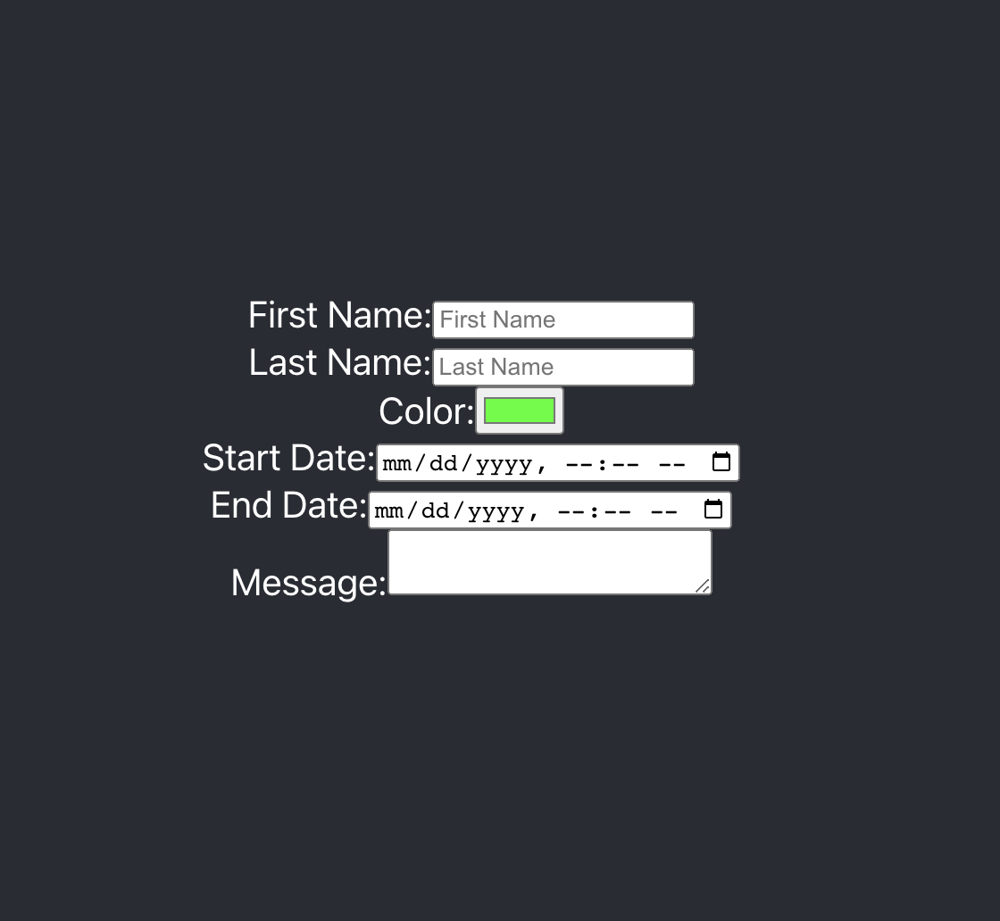

# Form Practice - React.jsx Form Practice 

Building a React app with onchange functionality for an HTML form for BocaCode in class practice. 



## Website Link
[See Link](https://form-practice-vc.web.app/)

## Covered In Class
* onChange
* Form Elements
* Controlled Components
* Coded in React
* Deployed on Firebase

## Basic Code
```
<label> First Name:
<input type="text">
</label>

```